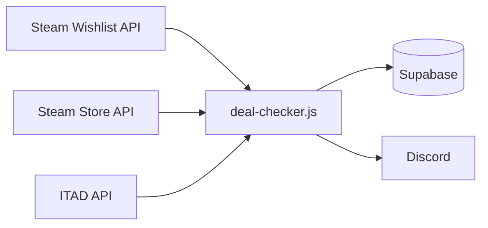

# Donki's Deal

Personal Steam wishlist tracker that scores deals and pings Discord when something is actually worth buying — not just when it's on sale.

---

## What it does

Every 2 hours, a GitHub Action runs a Node.js script that:

- Pulls my Steam wishlist via the Steam Web API
- Fetches current Steam prices in MYR (Malaysian region)
- Queries IsThereAnyDeal for cross-store prices (Fanatical, Humble, GOG)
- Scores each wishlisted game on a 0–10 **Buy Score**
- Sends a Discord alert when a game scores 8 or higher
- Tracks free game giveaways across Steam, Epic, and ITAD
- Records every price observation to Supabase for historical analysis

The goal isn't "notify me about every sale" — Steam already does that.  
The goal is: **notify me when a game is genuinely near its historical low so I stop checking manually.**

---

## How the Buy Score works

Score is calculated per game, every run, on a 0–10 scale:

| Component | Max | Source |
|---|---|---|
| Historical-low proximity | 3.5 | Current Steam-MY price vs. lowest Steam-MY price ever observed |
| Discount depth | 4.0 | Steam discount % |
| Wishlist membership | 1.5 | Flat bonus for being on the wishlist |
| Wishlist persistence | 0.5 | Age-based (older entries score higher) |
| Exceptional deep-discount bonus | 0.5 | Only when discount ≥ 70% **and** price is within 30% of historical low |

Alerts fire when score ≥ 8, with a 24-hour cooldown per game.

**Everything is Steam-only and MYR-only.** Cross-store prices (USD) are shown in alerts as informational context but never feed the score. Mixing currencies without conversion produces misleading scores, as this project learned the hard way.

---

## Cold-start behavior

The historical-low component requires observed history. Until a game has **a few weeks** of Steam-MY price snapshots, its low is treated as unknown and the component contributes 0 points. This means:

- During the first few weeks, no game can score above 6.5
- Alerts simply don't fire until the tracker has enough data
- No misleading "at its historical low!" pings from a game that's only ever been seen once

## Data flow

## Stack

- **Runtime:** Node.js 24 — no dependencies, plain `https` module
- **Automation:** GitHub Actions (cron `0 */2 * * *`)
- **Database:** Supabase (Postgres)
- **APIs:** Steam Web API, Steam Store API, IsThereAnyDeal
- **Notifications:** Discord webhooks

---

## Setup

Requires these environment variables (set as GitHub Actions secrets):

| Variable | Purpose |
|---|---|
| `STEAM_API_KEY` | Steam Web API key |
| `STEAM_ID` | Steam ID64 of the account whose wishlist to track |
| `DISCORD_WEBHOOK_URL` | Discord webhook for alerts |
| `SUPABASE_URL` | Supabase project URL |
| `SUPABASE_SERVICE_KEY` | Supabase service-role key |
| `ITAD_API_KEY` | IsThereAnyDeal API key |

Database tables: `wishlist`, `price_snapshots`, `buy_decisions`, `purchased`, `last_notified`, `notification_log`, `free_games_seen`, `tracked_stores`.

---

## Known limitations

- **Historical lows are tracker-observed, not all-time.** The low is the minimum price seen since this tracker started running. A game that went 80% off in 2023 and hasn't repeated won't be recognized as near its true historical low.
- **Regional pricing is a pain in the arse.** Steam MYR prices can differ significantly from Steam USD prices for the same game. The score uses MYR exclusively.
- **Coming-soon games have no price.** They're tracked for release but skipped in scoring until Steam returns pricing.
- **ITAD's historical low is all-store, USD-only.** Useful as context, not used in scoring.

---

## Why this exists

I wanted a personal deal tracker that:

1. Doesn't spam me with every 20%-off sale
2. Doesn't alert me for a "sale" that's still 300% above the game's real low
3. Actually knows the difference between **on sale** and **at its best price**

Steam's built-in wishlist notifications don't do any of that. This does.
